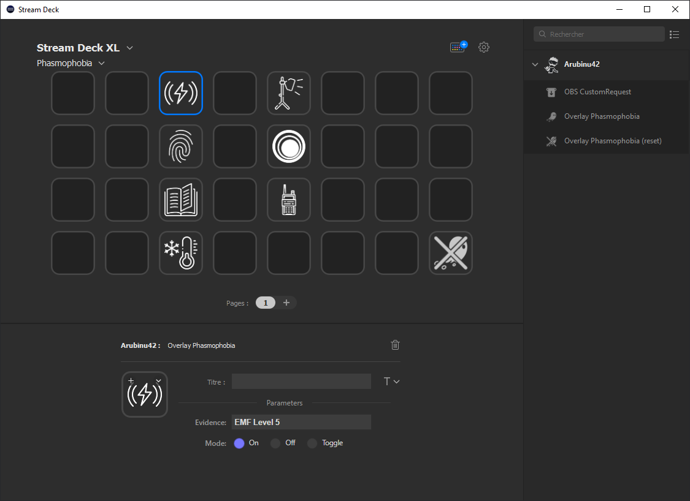

# StreamDeck Plugin

#### This plugin brings together my different tools.
 

For the moment it communicates with the __OBS WebSocket__ (Thanks to Durss for his plugin which served me as a base) to send actions to the overlays for:
  - Phasmophobia

